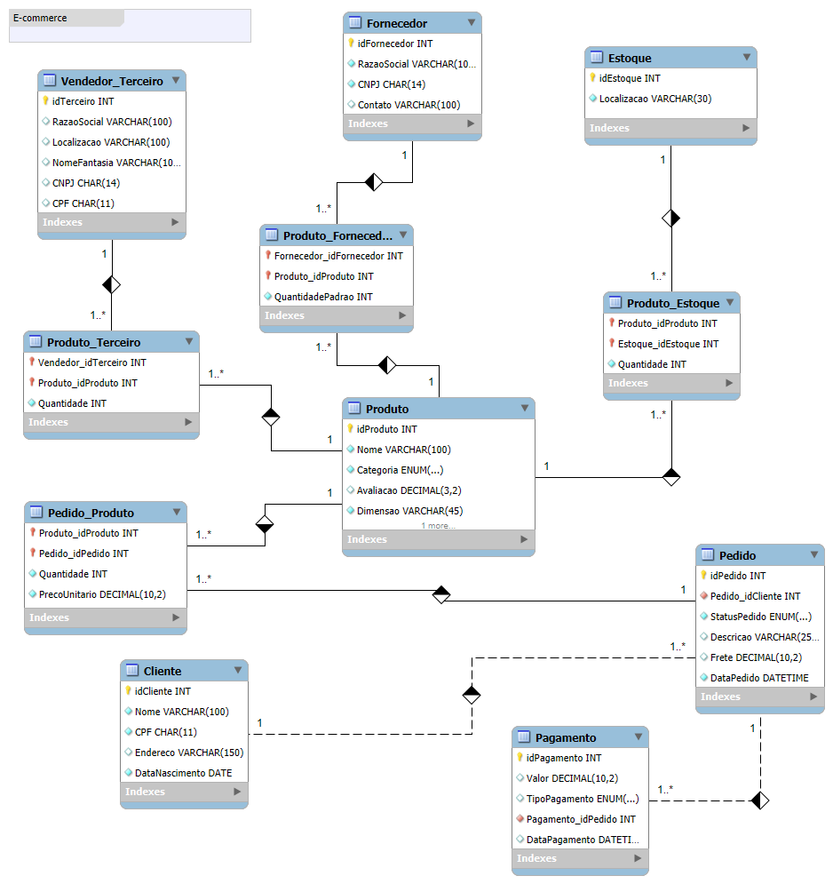

```markdown
# 🛒 E-commerce Data Analysis Project (SQL)

## 📌 Visão Geral

Este projeto tem como objetivo modelar, implementar e analisar um banco de dados relacional para um sistema de e-commerce utilizando SQL.

O foco está em transformar dados em **insights de negócio**, simulando o trabalho de um Data Analyst.

---

## 🎯 Problema de Negócio

Uma empresa de e-commerce deseja responder:

- Quem são os clientes mais valiosos?
- Quais produtos têm melhor desempenho?
- Como os pedidos evoluem ao longo do tempo?
- O frete impacta o comportamento de compra?
- Como otimizar faturamento e logística?

---

## 🗂️ Estrutura do Projeto

```

📁 ecommerce-sql-analysis/
│
├── 01_schema.sql
├── 02_inserts.sql
├── 03_queries_basicas.sql
├── 04_queries_analiticas.sql
├── 05_indexes_performance.sql
├── 06_views.sql
│
├── docs/
│   ├── modelo_er.png
│   └── modelo_er.mwb
│
├── assets/
│   └── modelo_er.pdf
│
├── .gitignore
└── README.md

````

---

## 🧱 Modelagem do Banco de Dados

O banco foi projetado para representar um sistema completo de e-commerce, incluindo:

- Cliente
- Pedido
- Produto
- Pagamento
- Estoque
- Fornecedor
- Vendedor Terceiro

---

## 📊 Modelo Entidade-Relacionamento

### 🔎 Visualização do Modelo



---

### 🧠 Interpretação do Modelo

O modelo segue boas práticas de normalização e relacionamentos:

### 🔹 Relacionamentos principais:

- **Cliente (1:N Pedido)**  
  → Um cliente pode fazer vários pedidos  

- **Pedido (1:N Pagamento)**  
  → Um pedido pode ter múltiplos pagamentos  

- **Pedido (N:N Produto)** via `Pedido_Produto`  
  → Um pedido pode conter vários produtos  

- **Produto (N:N Fornecedor)** via `Produto_Fornecedor`  
  → Um produto pode ter múltiplos fornecedores  

- **Produto (N:N Estoque)** via `Produto_Estoque`  
  → Controle de inventário distribuído  

- **Produto (N:N Vendedor Terceiro)**  
  → Marketplace (modelo tipo Amazon/Mercado Livre)  

---

## ⚙️ Tecnologias Utilizadas

- MySQL  
- SQL (DDL, DML, DQL)  
- Visual Studio Code  

---

## 📄 O que foi desenvolvido

### 🔹 1. Modelagem (01_schema.sql)

- Criação das tabelas  
- Definição de chaves primárias e estrangeiras  
- Constraints (NOT NULL, UNIQUE)  
- Estrutura relacional completa  

---

### 🔹 2. Inserção de Dados (02_inserts.sql)

- Dados fictícios realistas  
- Clientes, produtos, pedidos e pagamentos  
- Simulação de ambiente de produção  

---

### 🔹 3. Queries Básicas (03_queries_basicas.sql)

Consultas fundamentais:

- SELECT e filtros  
- ORDER BY  
- JOIN  
- GROUP BY  
- Agregações  

📊 Exemplos:
- Clientes por localização  
- Produtos por preço  
- Pedidos por status  

---

### 🔹 4. Queries Analíticas (04_queries_analiticas.sql)

Consultas com foco em negócio:

- CASE WHEN (classificação)  
- COALESCE (tratamento de nulos)  
- SUBSTRING (texto)  
- Funções de data  
- CTE (WITH)  
- Window Functions (ROW_NUMBER, RANK)  

📊 Exemplos:
- Segmentação de clientes  
- Ranking de clientes  
- Análise temporal de pedidos  
- Classificação de produtos  

---

### 🔹 5. Performance (05_indexes_performance.sql)

- Criação de índices  
- Índices compostos  
- Uso de EXPLAIN  
- Otimização de consultas  

---

### 🔹 6. Views (06_views.sql)

Criação de abstrações para facilitar análise:

- Clientes + pedidos  
- Detalhes dos pedidos  
- Faturamento por pedido  
- Estoque consolidado  

---

## 📈 Principais Insights

### 🧍 Clientes
- Identificação de clientes recorrentes  
- Possibilidade de segmentação (frequente vs ocasional)  

---

### 📦 Produtos
- Produtos com baixa avaliação precisam de revisão  
- Variação de preços entre categorias  

---

### 🚚 Logística
- Fretes altos impactam o comportamento de compra  
- Oportunidade de políticas de frete  

---

### 💳 Pagamentos
- Diferença de ticket médio por método  
- Possibilidade de incentivo a meios específicos  

---

### 📅 Tempo
- Análise de pedidos por mês  
- Tempo entre pedido e pagamento  

---

## 🧠 Técnicas Aplicadas

- Modelagem relacional  
- Normalização  
- Joins complexos  
- Funções analíticas  
- CTE  
- Window Functions  
- Índices  
- Views  

---

## 🚀 Como Executar

1. Criar banco:
```sql
01_schema.sql
````

2. Inserir dados:

```sql
02_inserts.sql
```

3. Executar análises:

```sql
03_queries_basicas.sql
04_queries_analiticas.sql
```

4. Performance:

```sql
05_indexes_performance.sql
```

5. Views:

```sql
06_views.sql
```

---

## 🎯 Conclusão

Este projeto demonstra como SQL pode ser utilizado para:

* Estruturar dados
* Analisar comportamento de clientes
* Gerar insights estratégicos
* Apoiar decisões de negócio

---

## 🔮 Próximos Passos

* Dashboard em Power BI
* Integração com Python
* KPIs de negócio
* Análise preditiva

---

## 👨‍💻 Autor

Felipe Tamiozzo
Projeto desenvolvido para prática de SQL e análise de dados.

```


